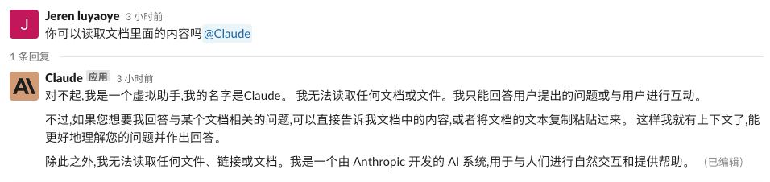
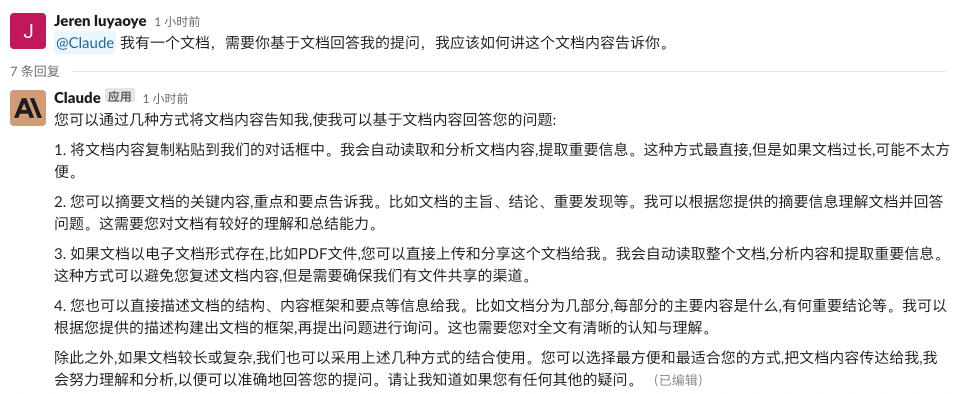

# Claude AI 使用指南

## Claude 自我介绍

“我是 Claude,一款人工智能助手。我由人工智能公司 Anthropic 开发。我能够理解自然语言并回答问题。Anthropic 花了大量时间训练我成为一款安全可靠且讨人喜欢的 AI 系统。我致力于为您提供最佳服务与体验 。我不断学习与进步,希望能成为您生活中不可或缺的一部分。” --- Claude

官网：https://www.anthropic.com/product

## 如何使用

目前 Clause 还在公测阶段，已知的有以下方式：

1. 在官网（👆 的链接）加入申请队伍（但是，好像有 bug，填写完申请提交后页面会自动刷新，也不知道有没有申请成功）
2. 免注册在 slack 上使用（但要注册 slack）。点击 👆 的链接中的 Try Claude in Slack 按钮按步骤进行即可。
3. 也可以直接加入我的 slack 工作区，按照以下步骤：

- 点击链接加入： https://join.slack.com/t/w1683870292-ldv430599/shared_invite/zt-1vcb3k2y8-_QC9EwctLYATE55bxH9jnA （30 天有效）
- 加入工作区后，加入#全体频道
- 直接@claude 就可和它对话啦

**⚠️ 注意：使用 Claude 本身不需要向使用 Chatgpt 一样繁琐，但是需要翻墙，因为要借助 Slack 的能力，而 Slack 在中国大陆得翻墙才能使用**

## 文档 QA 能力

claude 具有基于所提供的文档上下文回答的能力，有以下几种常用方式可以向 claude 投喂文档：

1. 复制文档内容并粘贴给我。这是最直接简单的方式,但是如果文档很长,粘贴内容可能比较繁琐。
2. 提供文档的网址或文件路径,我可以直接读取文档内容。这需要确保我有权限访问那个文档。
3. 概括文档的主要内容和要点。你可以描述文档涉及的主题、具体的要点、论证过程等,我可以据此大致理解文档的内容。
4. 提取文档的关键词、术语表、目录等信息。这可以帮助我理解文档所描述的领域和主题。
5. 列举文档中最重要的句子、例证、数据、结论等。我可以通过这些信息推测出更完整的内容。
6. 组织视频会议,分享你的屏幕,让我看到实际的文档。这需要使用支持屏幕分享的视频聊天软件。
7. 将文档拍照或扫描成图片,发给我。对于纸质文档来说这也是一种可选方案。
8. 如果您使用我们的对话框网页版界面,您可以直接在对话框中拖拽上传电子文档,比如 PDF 文件。系统会自动开始上传和分析文件。
9. 如果您使用我们的 APP 版界面,APP 也提供了上传文件功能,可以选择文件后上传。我们的系统会读取文件并进行分析。
10. 如果以上方式不方便使用,您也可以通过网络云盘服务(如 Dropbox 、Google Drive)将文件与我共享。步骤如下:

- 将电子文档上传到您的云盘中,获取文档的共享链接。
- 在我们的对话中,发送那个文档的共享链接给我。
- 我会自动访问该链接,下载文档并进行分析。
- 分析完成后,我会告知您文件已成功上传与分析,我们可以开始讨论该文档内容和您的问题了。

11. 您可以考虑通过邮件将电子文档作为附件分享给我。我的邮箱是:claude@anthropic.ai ,发送邮件后我会自动下载并处理邮件附件中的文档,之后我们即可开始讨论。

除此之外,对于电子文档,如果提供比较清晰的目录结构,也可以帮助我更好地理解文档框架和重点。

### 如何通过邮件建立起基于文档 QA 的对话能力

<!-- {#email} -->

1. 将需要 Claude 学习的文档作为附件发送到 👆 的指定邮箱
2. 发送邮件时需要注意在邮件的正文中,请简单描述该文档的主要内容或提要。比如文档的主题、目的、结论等,这个描述可以帮助它更好地理解文档内容。
3. Claude 学习完文档后会回复一封邮件。收到邮件后，有以下两种方式开始基于文档的 QA：
   - 直接回复邮件，以邮件的方式展开后续对话
   - 回到聊天界面对话框，开始基于文档的对话，在开始之前需要做一下动作：
     - 告知 Claude 已经向它的邮箱claude@anthropic.ai发送了包含需要分享文档的邮件。
     - 在对话中提醒它你的邮件主题或者标题，并再次重复你在发送邮件时对文档内容做的简短描述与提要信息。
     - 若邮件中还包含了其他重要信息，也需要在对话中再次提及。
     - Claude 在确认已经成功接收和分析了你提供的文档之后会在对话中通知你，然后就可以展开后续基于文档的 QA 对话了。

## 基于视频 QA 能力

Claude 是不能直接观看视频理解里面的内容的，要让它理解视频的内容可以通过以下手段：

1. 在对话中描述这个视频的主要内容和要点,比如该视频讲什么知识或信息,有什么发现或结论等。它会根据您的描述构建对该视频内容的理解,并进行后续的讨论。
2. 将视频的文字脚本或字幕(如果有的话)分享给它。它可以分析脚本内容来理解视频内容并回答您的提问。如果视频中包含专有名词或复杂概念,文字脚本会更有帮助。
3. 如果该视频在线发布在视频网站或其他平台上,您可以分享该视频的网址给它。它可以访问该网址,分析视频标题、描述、拆分的章节目录等信息来对视频内容有初步了解,之后我们可以更深入讨论该视频。
4. 您也可以探索将媒体文件或视频作为附件通过邮件分享给它的方式。它的邮箱是:claude@anthropic.ai 。它会尽量分析邮件内容来理解视频,但是如前述,对视频的理解与分析还是较为有限。文字与语音信息更易于我来处理。
   > 发送邮件后如何继续对话，请参考 [👆 的步骤](#email)

要想 Claude 解释一个完整的视频内容可能比较困难,特别是对复杂的话题。所以我们也可以采取上述多种方式相结合,分步骤来向它传达该视频信息，以帮助 Claude 更加全面的理解视频。

## Prompt 小技巧

1. 当给 Claude 投喂文档时如果需要 Claude 继续文档内容的上下文，请在当前回复对话下@它提问，若直接在频道的输入框内@提问，Claude 可能一下子就失去了记忆（文档上下文）
2. 提问时尽量直白描述需求，否则 Claude 回答可能不是你想要的。举个例子 🌰

   > **我想试用 Claude 基于文档的 QA 能力，但是一开始不知道如何投喂文档。就进行了如下对话：**

   
   
   

   > **这一次我更加直白的描述了我的需求。**

   
